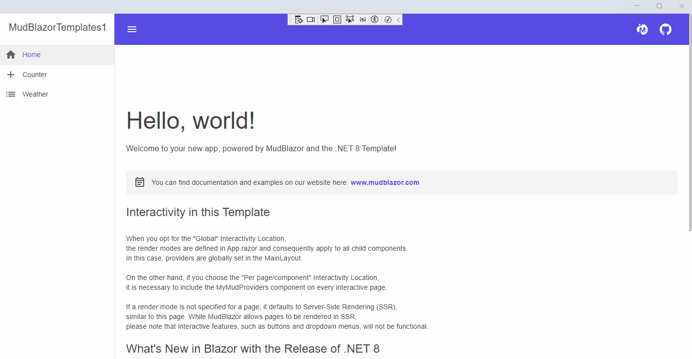

# blazor-maui-hybrid
A simple web application with MAUI deployed as a Windows desktop application.
The MudBlazor example template is used as replacement of the existing example just to see that all is working fine especially with the styles and js scripts.


## DevTools 
Use the keyboard shortcut Ctrl+Shift+I to open browser developer tools.

## HowTo

1. Create a MAUI Blazor hybrid application by opening Visual Studio and create a MAUI Blazor hybrid application
2. Add nuget MudBlazor
3. Update _Imports.razor

```
...
@using MudBlazor
@using MudBlazor.Services
```


3. Update MauiProgram.cs

```
        builder.Services.AddMudServices();

```

3. Update index.html

```
<head>
	...
    <link href="_content/MudBlazor/MudBlazor.min.css" rel="stylesheet" />
</head>


...
<body>

    <script src="_content/MudBlazor/MudBlazor.min.js"></script>
</body>
```

4. Delete all existing components and all from MudBlazor template for a blazor server app.



